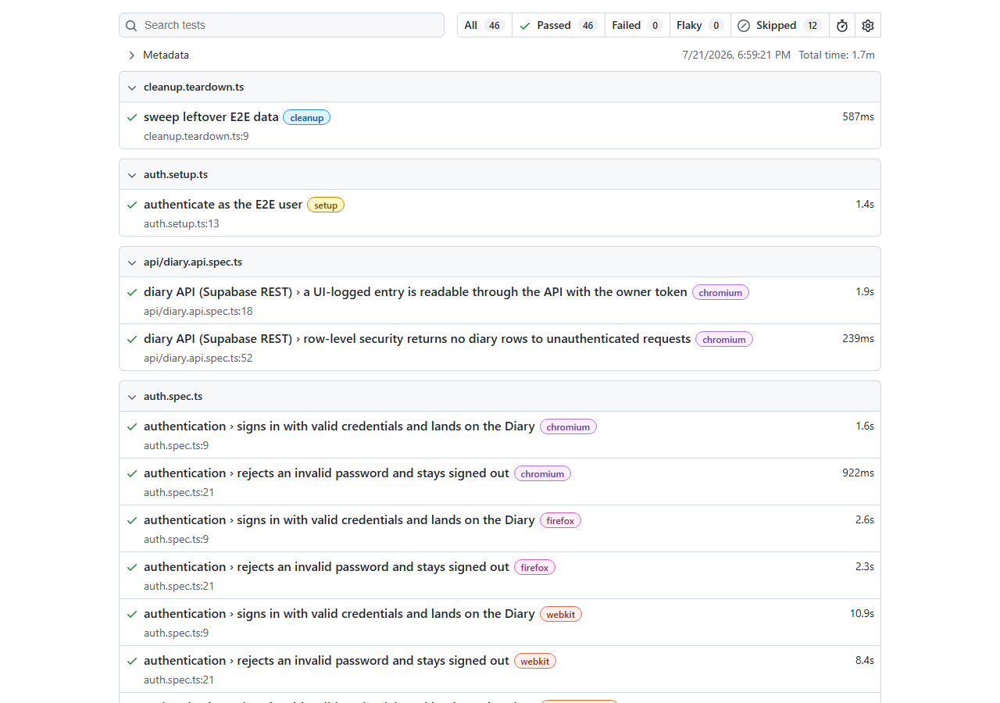

# FitLog E2E — Playwright Test Automation Framework

[](https://github.com/kakaul94-prof/fitlog-e2e/actions/workflows/e2e.yml)
[](https://kakaul94-prof.github.io/fitlog-e2e/)

End-to-end test automation for **[FitLog](https://github.com/kakaul94-prof/FitLog)** — a live
React 19 + Supabase PWA for tracking nutrition, strength, cardio, and body weight.
Built with **Playwright + TypeScript (strict)**, a **Page Object Model** architecture,
cross-browser + mobile projects, and **GitHub Actions CI** that publishes the HTML
report to GitHub Pages on every run.

[](https://kakaul94-prof.github.io/fitlog-e2e/)

## What this demonstrates

- **Page Object Model** — locators and interactions live in `pages/`; specs read like
  user scenarios (`await loginPage.signIn(email, password)`).
- **Custom fixtures** — `fixtures/test-options.ts` extends Playwright's `test` so every
  spec receives typed, ready-made page objects.
- **Authenticate once, reuse everywhere** — `tests/auth.setup.ts` signs in through the
  real UI and saves `storageState`; all browser projects start authenticated.
- **Cross-browser + mobile** — Chromium, Firefox, WebKit, and a Pixel 7 viewport
  (FitLog is phone-first).
- **CI/CD** — typecheck + lint + tests on every push/PR; HTML report deployed to
  GitHub Pages even when tests fail.
- **Web-first assertions, no sleeps** — role/label/text locators, auto-waiting
  `expect(locator)` assertions, zero `waitForTimeout`.

## Running locally

```sh
npm ci
npx playwright install
cp .env.example .env   # then fill in the test-account credentials
npm test               # full matrix
npm run test:chromium  # single browser while iterating
npm run report         # open the HTML report
```

Environment variables (see `.env.example`): `BASE_URL`, `E2E_EMAIL`, `E2E_PASSWORD`,
plus `SUPABASE_URL` / `SUPABASE_ANON_KEY` for the API specs. Locally they come from a
gitignored `.env`; in CI they are repository secrets. No secrets are ever committed.

## Coverage

| Area | Spec | Status |
|---|---|---|
| Authentication (positive + negative) | `tests/auth.spec.ts` | ✅ |
| Navigation smoke (all tabs, no runtime errors) | `tests/navigation.spec.ts` | ✅ |
| Food diary logging + day totals (quick add, multi-add) | `tests/diary.spec.ts` | ✅ |
| Diary move-to-meal, copy-to-day, copy-previous-day | `tests/diary-move-copy.spec.ts` | ✅ |
| Streak healing via backfill | `tests/goals.spec.ts` | ✅ |
| Food search, manual + USDA import, rescale, soft-delete | `tests/food-search.spec.ts` | ✅ |
| Recipes (per-serving, recompute, unit conversion, duplicate) | `tests/recipe.spec.ts` | ✅ |
| Cardio (logged burn + custom-activity MET estimate) | `tests/cardio.spec.ts` | ✅ |
| Strength (sets, e1RM, prefill, supersets, records, goal suggestions) | `tests/strength.spec.ts` | ✅ |
| Nutrient breakdown (%DV, missing-data dashes) | `tests/nutrients.spec.ts` | ✅ |
| Body measurements → Progress history | `tests/measurements.spec.ts` | ✅ |
| Streak indicator after logging today | with diary specs | ✅ |
| Diary entry editing (servings, meal) + delete | `tests/diary-entry.spec.ts` | ✅ |
| Saved meals (multi-select → save → relog) | `tests/meals.spec.ts` | ✅ |
| Calorie goal, eat-back credit, macro target modes | `tests/goals.spec.ts` | ✅ |
| Workout templates (targets persist, start workout) | `tests/routine.spec.ts` | ✅ |
| Accessibility: axe scan, login + all tabs | `tests/a11y.spec.ts` | ✅ |
| API: UI-insert → REST verify, RLS negative, row contract | `tests/api/diary.api.spec.ts` | ✅ |

## Design decisions

- **Tests target a deployed environment** (`BASE_URL`), not a local build — the suite
  verifies what users actually receive, and the same suite can point at any
  environment via env var.
- **Dedicated test account** — Supabase Row-Level Security is owner-only on every
  table, so E2E data is fully isolated from real accounts.
- **Idempotent, self-cleaning data** — specs that write use per-run unique values
  (and unique past dates for day-total assertions, so parallel projects sharing the
  account never collide) and delete what they create via the Supabase REST API with
  the test user's own token. A teardown project sweeps anything a crashed run left
  behind.
- **`storageState` auth** — one real-UI login per run instead of one per test:
  faster, and auth flakiness is confined to a single setup project. The API client
  reuses that saved token too, so REST seeding/cleanup adds zero extra sign-ins.
- **Single-project gating where the matrix adds nothing** — the USDA import
  (external API), calorie-goal (one global profile row), and REST API specs run on
  desktop Chrome only, with the reason annotated at the skip.
- **Honest flake policy** — a remote target means occasional cold-start stalls:
  one local retry / two in CI, so genuine regressions fail while stalls surface as
  "flaky" in the report instead of being hidden.

## About the app under test

FitLog is a personal, phone-first fitness PWA (React 19, Vite, Tailwind v4, TanStack
Query, Supabase Postgres + Auth) — [repo](https://github.com/kakaul94-prof/FitLog) ·
[live app](https://fitlog-9wl.pages.dev). This framework lives in a separate repo, as
it would for an independent QA team.

## Future work

- Upstream accessibility fixes in the app, then shrink the axe known-violations
  allowlist to empty: the scan caught two real critical issues on Progress
  (unlabeled weight input, unnamed type select) and app-wide muted-text color
  contrast (rule disabled with a note until fixed).
- `data-testid` / `role="alert"` hooks in the app for the few elements that lack
  accessible handles (login error paragraph, streak pill, icon-only "+" buttons,
  set-row inputs) — each workaround is annotated in the page objects.
- Visual regression snapshots, API contract tests.
- Data-driven expansion: multiple meals/serving sizes per flow, macro-target
  assertions, strength goals + progression suggestions.
